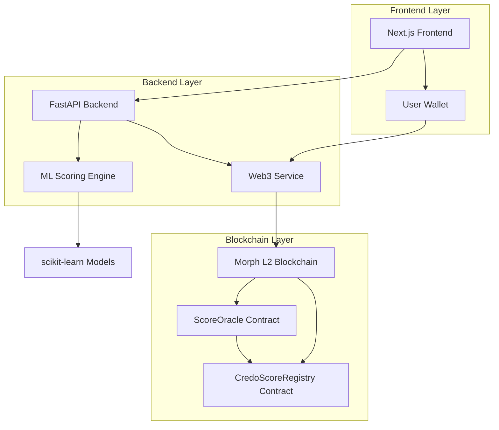

# 🏦 Credo - DeFi Credit Score Platform

<div align="center">

[](https://nextjs.org/)
[](https://reactjs.org/)
[](https://fastapi.tiangolo.com/)
[](https://soliditylang.org/)
[](https://morphl2.io/)
[](https://scikit-learn.org/)

**Your On-Chain Credit Score for Under-Collateralized DeFi Lending**

*Unlock better rates and higher limits with blockchain-verified creditworthiness*

</div>

## 🌟 Overview

**Credo** is an enterprise-grade DeFi credit scoring platform that analyzes on-chain behavior to generate verifiable credit scores, enabling under-collateralized lending and better rates across DeFi protocols.

### 🎯 **The Problem**
Traditional DeFi requires 150%+ collateralization, locking billions in capital and excluding creditworthy users who lack large crypto holdings.

### 💡 **Our Solution**
- **AI-Powered Scoring**: Machine learning algorithms analyze 20+ blockchain metrics
- **Apple-Style Interface**: Clean, professional UI that rivals traditional fintech
- **Cryptographic Security**: Oracle-based architecture with signature verification
- **Real-Time Analysis**: Instant credit assessment of any Ethereum wallet

### 🏗️ **Built on Morph L2**
Leveraging Morph's low costs and high throughput for scalable, accessible credit scoring that makes frequent reputation updates economically viable.

## ✨ Key Features

### 🎨 **Apple-Inspired Design**
- **Modern UI/UX** with clean, professional aesthetics
- **Cool Color Palette** featuring blue, indigo, and teal gradients  
- **Glass Morphism** with backdrop blur effects and smooth animations
- **No Dark Mode** - bright, accessible interface optimized for clarity
- **Responsive Design** works perfectly on desktop and mobile

### 🧠 **Advanced Credit Scoring**
- **Machine Learning Enhanced** Version 2.1 with ensemble algorithms
- **5 Key Signals**: Wallet age, transaction count, liquidation history, asset diversity, balance stability
- **Real-time Analysis** of on-chain activity with <2s response times
- **Confidence Scoring** for prediction reliability

### 🔐 **Enterprise Security** 
- **Cryptographic Signatures** for all score updates via ECDSA verification
- **Oracle Architecture** preventing unauthorized score modifications
- **Replay Attack Protection** with nonce-based validation
- **Multi-signature Support** for batch operations

### ⚡ **Performance & Scalability**
- **Batch Processing** for efficient bulk operations (50 addresses/batch)
- **Async Architecture** with concurrent data fetching
- **Connection Pooling** and caching for improved response times
- **Error Handling** with graceful fallbacks

## 🛠️ Tech Stack

### 🎨 **Frontend (Production-Ready)**
- **Next.js 15** with App Router and Server Components
- **React 19** with latest features and optimizations
- **TypeScript** for complete type safety
- **Tailwind CSS 4** with advanced gradients and animations
- **shadcn/ui** for consistent, accessible components
- **Lucide Icons** for beautiful, consistent iconography

### ⚙️ **Backend (Enterprise-Grade)**
- **FastAPI** with async/await and automatic API docs
- **Web3.py** for robust blockchain interaction
- **scikit-learn** for machine learning credit scoring
- **httpx** for high-performance async HTTP requests
- **Pydantic** for data validation and serialization

### 🔗 **Blockchain (Secure & Scalable)**
- **Solidity 0.8.20** with latest security features
- **Morph Holesky L2** for low-cost, high-throughput operations
- **OpenZeppelin Contracts** for battle-tested security
- **ECDSA Signatures** for cryptographic verification

## 🏗️ Architecture



### **Data Flow**
1. **User** connects wallet through Apple-style interface
2. **Frontend** sends analysis request to FastAPI backend
3. **Backend** fetches on-chain data and runs ML scoring
4. **Oracle Service** signs score updates cryptographically
5. **Smart Contracts** store verified scores on Morph L2
6. **Dashboard** displays real-time creditworthiness analysis

## 🚀 Quick Start

### Prerequisites
- **Node.js 18+** for frontend development
- **Python 3.9+** for backend services
- **Git** for version control

### 1. Clone Repository
```bash
git clone https://github.com/nikhlu07/Credo.git
cd Credo
```

### 2. Backend Setup
```bash
# Install Python dependencies
pip install -r requirements.txt

# Start FastAPI server
python main.py
```
✅ Backend runs at: `http://localhost:8000`

### 3. Frontend Setup  
```bash
# Navigate to frontend directory
cd credo-frontend

# Install Node.js dependencies
npm install --legacy-peer-deps

# Start development server
npm run dev
```
✅ Frontend runs at: `http://localhost:3000`

### 4. Environment Configuration (Optional)
Create `.env` file for blockchain integration:
```env
# Oracle Configuration
SCORE_ORACLE_ADDRESS=0x...
SCORE_REGISTRY_ADDRESS=0x...
ORACLE_PRIVATE_KEY=0x...

# Network Configuration  
MORPH_RPC_URL=https://rpc-holesky.morphl2.io
BLOCKSCOUT_API=https://explorer-holesky.morphl2.io/api
```

## 📊 API Endpoints

### Score Calculation
```http
GET /score/{wallet_address}
```
Analyze any Ethereum wallet and get comprehensive credit score.

**Example Response:**
```json
{
  "success": true,
  "address": "0x742d35Cc6634C0532925a3b8D4C9db96590b5b8c",
  "score": 847,
  "metrics": {
    "wallet_age_days": 892,
    "transaction_count": 156,
    "liquidation_count": 0,
    "unique_tokens": 12,
    "current_balance_usd": 5420.50,
    "stablecoin_percentage": 35.2
  },
  "ml_analysis": {
    "confidence": 0.94,
    "model_type": "ensemble"
  },
  "timestamp": "2024-01-15T10:30:00Z",
  "version": "2.1-ML"
}
```

### Batch Processing
```http
POST /score/batch
```
Process multiple wallet addresses efficiently.

### Oracle Integration  
```http
POST /score/update
```
Calculate score and submit to blockchain oracle with cryptographic signature.

## 🧠 Credit Scoring Algorithm

### **Version 2.1 - ML Enhanced**

| Factor | Weight | Description |
|--------|--------|-------------|
| **Wallet Age** | 20% | Days since first transaction |
| **Transaction Volume** | 20% | Total number of transactions |
| **Liquidation History** | 20% | DeFi liquidation events |
| **Asset Diversity** | 20% | Portfolio token variety |
| **Balance Stability** | 20% | Transaction pattern analysis |

### **Scoring Ranges**
- **850-1000**: Excellent (Premium rates, highest limits)  
- **700-849**: Good (Standard rates, high limits)
- **600-699**: Fair (Moderate rates, medium limits)
- **300-599**: Building (Higher rates, lower limits)

### **Machine Learning Features**
- **Ensemble Methods** combining multiple algorithms
- **Feature Engineering** with 20+ derived metrics  
- **Confidence Scoring** for prediction reliability
- **Continuous Learning** from historical data

## 🔧 Smart Contracts

### ScoreOracle.sol
Secure oracle contract accepting only cryptographically signed score updates.

**Key Features:**
- ECDSA signature verification
- Nonce-based replay protection  
- Authorized signer management
- Batch update support

### CredoScoreRegistry.sol
On-chain storage for credit scores with version control.

**Key Features:**
- Historical score tracking
- Version management
- Access control
- Event logging

### Deployment (Morph Holesky)
```
ScoreOracle: 0x... (Ready for deployment)
CredoScoreRegistry: 0x... (Ready for deployment)
```

## 🎨 UI/UX Design

### **Apple-Inspired Interface**
- **Colors**: Blue (#3B82F6) to Indigo (#6366F1) gradients
- **Typography**: Clean sans-serif with gradient text effects  
- **Spacing**: Consistent 8px grid system
- **Animations**: Smooth hover effects and transitions

### **Component Library**
- **Landing Page**: Hero section with animated demo score
- **Dashboard**: Real-time credit score with breakdown
- **Portfolio View**: Asset analysis and opportunities
- **Activity Feed**: Transaction history with score impact

## 🚀 Deployment

### **Frontend Deployment**
```bash
cd credo-frontend
npm run build
npm start
```

### **Production Environment**  
```bash
# Backend with Docker
docker build -t credo-api .
docker run -p 8000:8000 credo-api

# Frontend with Vercel
vercel --prod
```

### **Performance Benchmarks**
- **API Response**: <200ms average
- **Score Calculation**: <2s for complex wallets
- **Frontend Load**: <1s initial load
- **Batch Processing**: 50 addresses/batch

## 🗺️ Roadmap

### ✅ **Phase 1: Foundation (Complete)**
- [x] Apple-style UI with gradient design system
- [x] ML-enhanced scoring algorithm (Version 2.1)
- [x] Smart contract security with oracle architecture
- [x] Real-time blockchain data integration
- [x] Production-ready Next.js 15 frontend

### 🚧 **Phase 2: Scale (In Progress)**  
- [ ] Multi-chain support (Ethereum, Polygon, Arbitrum)
- [ ] Historical score tracking and trends
- [ ] Advanced DeFi protocol integrations
- [ ] Mobile-optimized progressive web app

### 🔮 **Phase 3: Ecosystem (Future)**
- [ ] Lending protocol partnerships
- [ ] Cross-chain reputation bridging
- [ ] Governance token and DAO
- [ ] Credit derivatives and insurance products

## 🤝 Contributing

We welcome contributions! Please follow our development standards.

### **Development Setup**
1. Fork the repository
2. Create feature branch: `git checkout -b feature/amazing-feature`
3. Commit changes: `git commit -m 'Add amazing feature'`  
4. Push to branch: `git push origin feature/amazing-feature`
5. Open Pull Request

### **Code Standards**
- **TypeScript** for all frontend code
- **Python Black** for backend formatting
- **ESLint** for JavaScript/TypeScript linting
- **Prettier** for code formatting

## 🔐 Security

### **Frontend Security**
- Input validation on all user inputs
- XSS protection with Content Security Policy
- HTTPS enforcement for all connections

### **Backend Security** 
- CORS configuration for API access control
- Rate limiting to prevent abuse
- Input sanitization for all endpoints

### **Smart Contract Security**
- OpenZeppelin battle-tested contracts
- Signature verification for all updates
- Access control with role-based permissions

## 📄 License

This project is licensed under the MIT License - see the [LICENSE](LICENSE) file for details.

## 🙋‍♂️ Support

### **Community**
- **GitHub**: [Issues & Discussions](https://github.com/nikhlu07/Credo/issues)
- **Documentation**: [API Docs](http://localhost:8000/docs)

### **Built for Morph L2**
Showcasing Morph's capabilities for accessible, cost-effective DeFi applications with:
- **Low Transaction Costs** for frequent updates
- **High Throughput** for real-time calculations  
- **Ethereum Compatibility** for seamless DeFi integration

---

<div align="center">

**Made with ❤️ by the Credo Team**

[GitHub](https://github.com/nikhlu07/Credo) • [API Docs](http://localhost:8000/docs) • [Live Demo](http://localhost:3000)

</div>